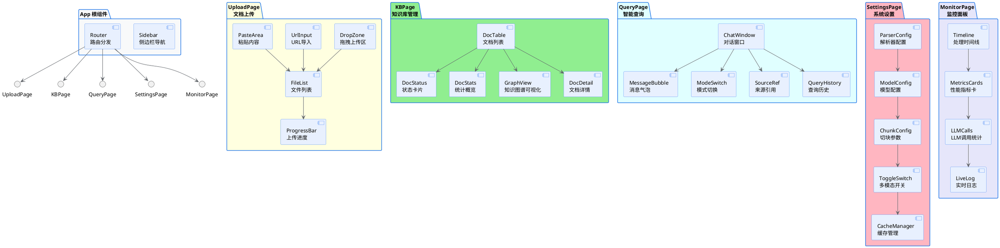
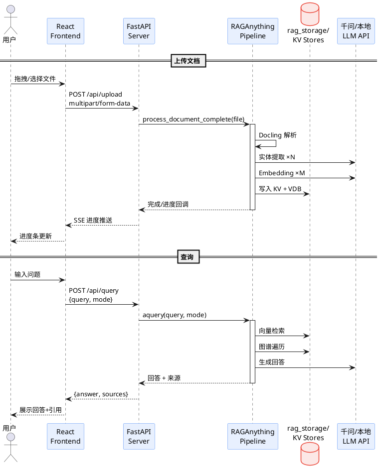
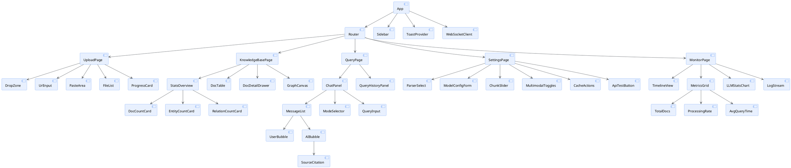

# RAG-Anything 前端架构设计

## 1. 组件树

## 2. 数据流

## 3. 组件树

## 4. 页面路由

| 路由 | 页面 | 说明 |
|------|------|------|
| `/` | 重定向到 /upload | 首页 |
| `/upload` | 文档上传 | 拖拽/文件夹/URL/粘贴四种方式 |
| `/knowledge` | 知识库管理 | 文档列表、图谱可视化、详情 |
| `/query` | 智能查询 | 对话式问答、多模式 |
| `/query/:id` | 查询详情 | 某次查询的完整对话 |
| `/settings` | 系统设置 | 解析器/模型/参数配置 |
| `/monitor` | 监控面板 | 实时状态、性能、日志 |
