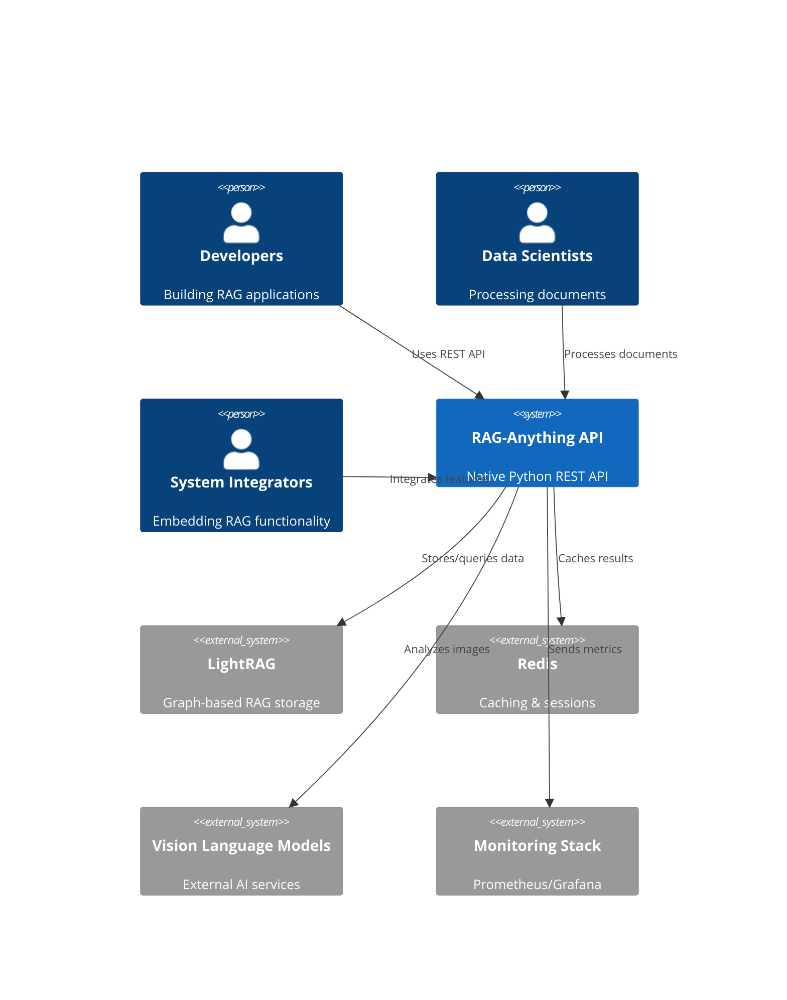
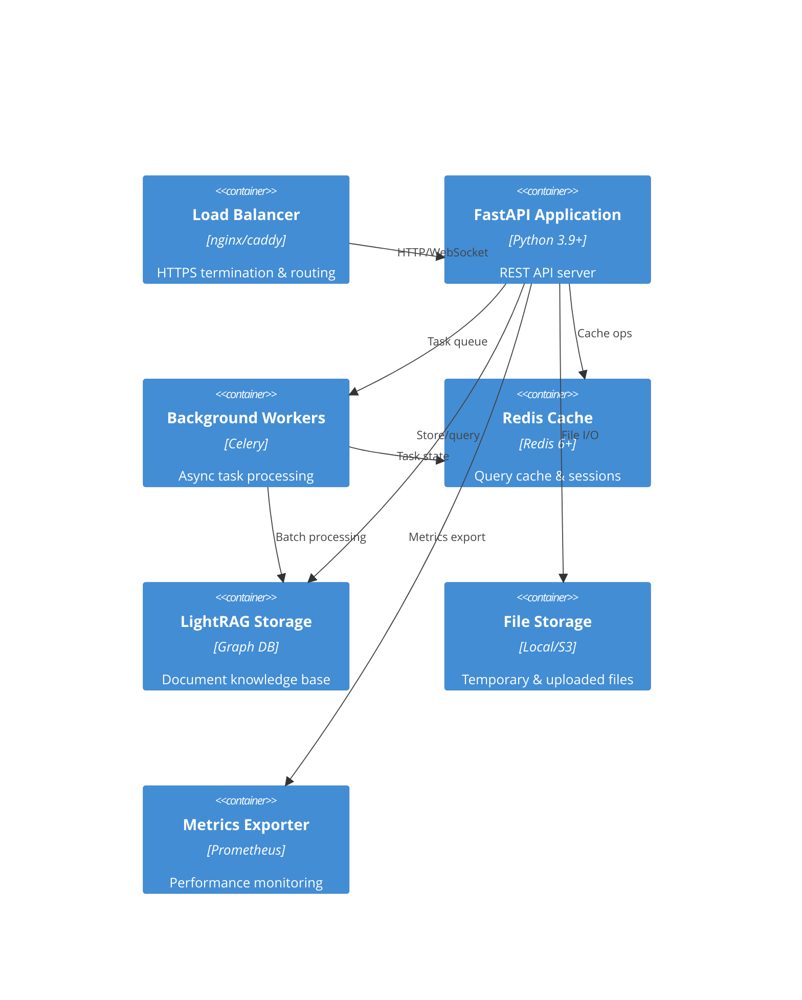
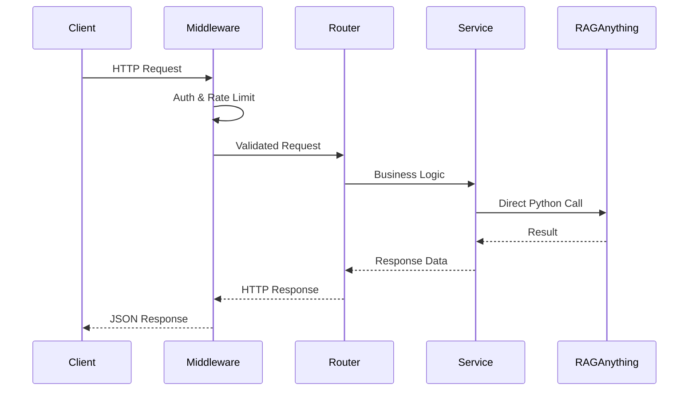
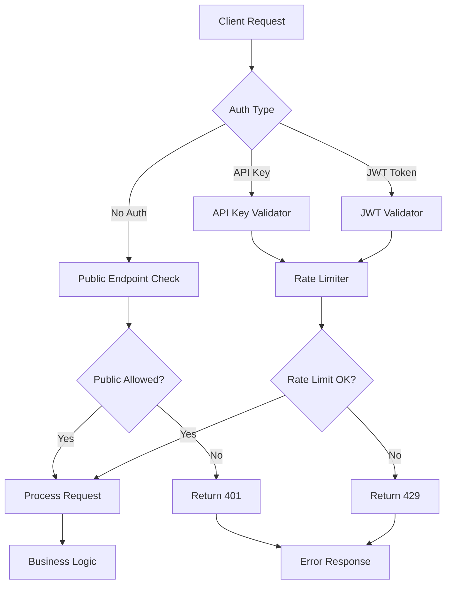
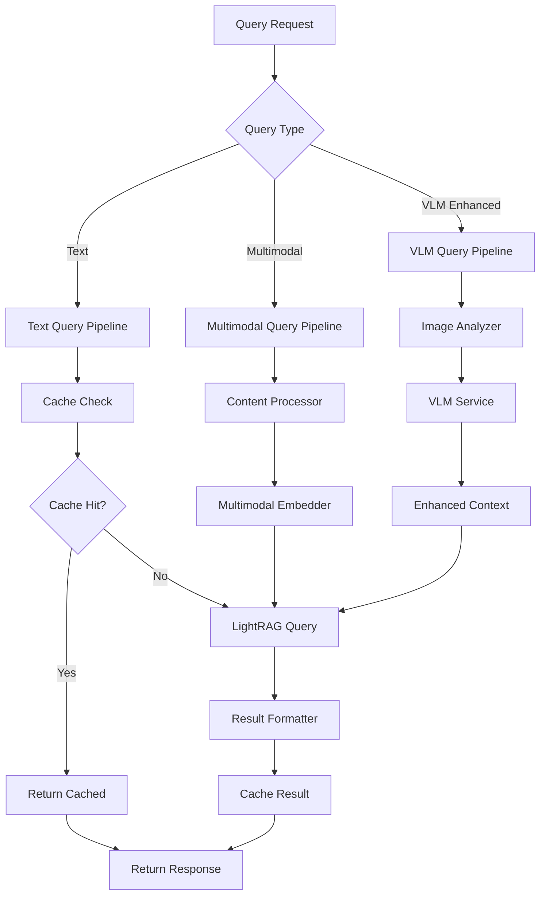
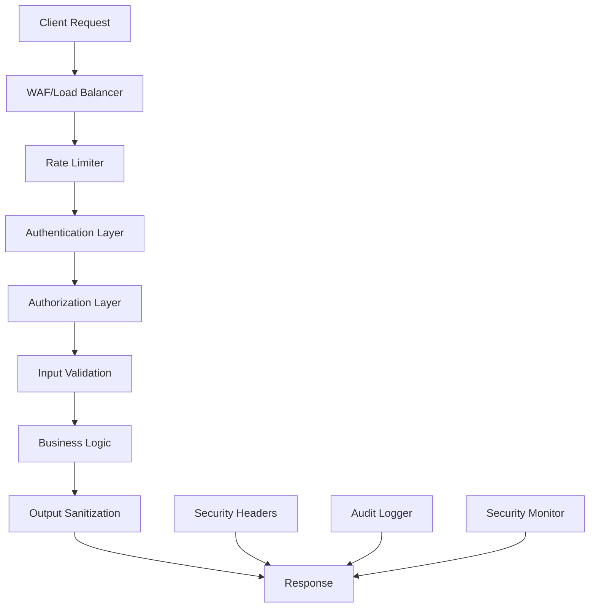
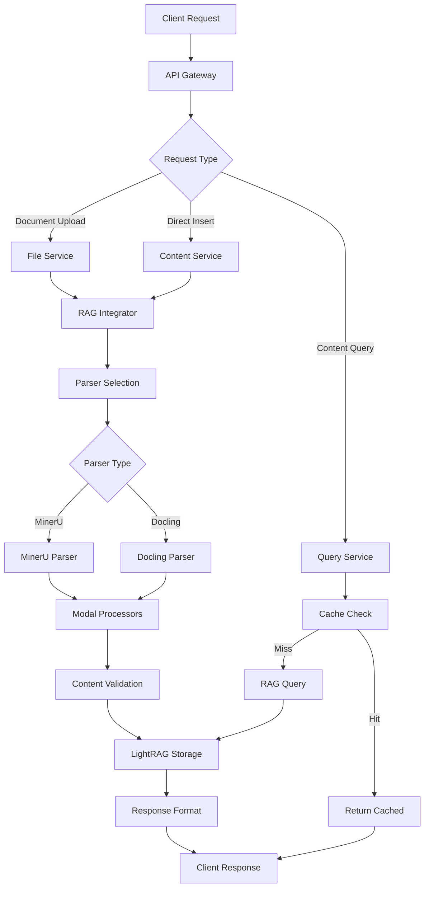
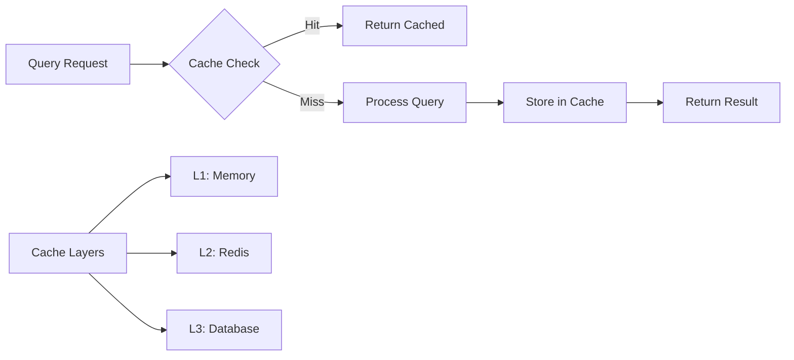

# RAG-Anything Native Python API - System Architecture

## Executive Summary

This document defines the system architecture for a native Python REST API that will replace the current Node.js/subprocess architecture for RAG-Anything. The new architecture eliminates subprocess overhead by directly importing RAG-Anything Python modules within a FastAPI application, providing superior performance, simplified deployment, and enhanced maintainability while maintaining full feature compatibility.

## Architecture Overview

### System Context


### Container Diagram


## Technology Stack

### Core Framework
- **FastAPI**: High-performance async web framework
- **Uvicorn**: ASGI server with async request handling
- **Pydantic**: Data validation and serialization
- **asyncio**: Native Python async/await support

### RAG Integration
- **RAGAnything**: Direct Python import, no subprocess
- **LightRAG**: Graph-based RAG storage and querying
- **MinerU/Docling**: Document parsing engines
- **Modal Processors**: Image, table, equation processing

### Infrastructure
- **Redis**: Caching, session storage, task queues
- **Docker**: Container deployment
- **Kubernetes**: Orchestration and scaling
- **Prometheus**: Metrics collection
- **nginx/caddy**: Load balancing and SSL termination

## Component Design

### 1. API Layer (FastAPI Application)

**Purpose**: HTTP request handling, validation, and routing
**Technology**: FastAPI with async route handlers
**Location**: `/app/api/`

#### Core Components:
- **Main Application** (`main.py`)
  - FastAPI app initialization
  - Middleware configuration
  - Exception handlers
  - Startup/shutdown events

- **Route Handlers** (`/routers/`)
  - `documents.py` - Document processing endpoints
  - `query.py` - Query execution endpoints
  - `content.py` - Content management endpoints
  - `files.py` - File upload/management endpoints
  - `health.py` - Health and monitoring endpoints

- **Models** (`/models/`)
  - Pydantic request/response models
  - Validation schemas
  - Type definitions

- **Middleware** (`/middleware/`)
  - Authentication middleware
  - Rate limiting middleware
  - CORS configuration
  - Request logging middleware

#### Request Flow:


### 2. Service Layer

**Purpose**: Business logic and RAGAnything integration orchestration
**Technology**: Pure Python classes with dependency injection
**Location**: `/app/services/`

#### Service Components:

##### DocumentService
```python
class DocumentService:
    def __init__(self, rag_integrator: RAGIntegrator, file_service: FileService):
        self.rag = rag_integrator
        self.files = file_service
    
    async def process_document(
        self, 
        file_data: bytes, 
        config: ProcessingConfig
    ) -> DocumentResult:
        # Direct RAGAnything integration
        # No subprocess communication
        pass
    
    async def batch_process(
        self, 
        file_ids: List[str], 
        config: BatchConfig
    ) -> BatchResult:
        # Async batch processing
        pass
```

##### QueryService
```python
class QueryService:
    def __init__(self, rag_integrator: RAGIntegrator, cache: CacheService):
        self.rag = rag_integrator
        self.cache = cache
    
    async def text_query(self, query: TextQuery) -> QueryResult:
        # Direct LightRAG query execution
        pass
    
    async def multimodal_query(self, query: MultimodalQuery) -> QueryResult:
        # Multimodal content processing
        pass
    
    async def vlm_enhanced_query(self, query: VLMQuery) -> QueryResult:
        # Vision language model integration
        pass
```

##### ContentService
```python
class ContentService:
    def __init__(self, rag_integrator: RAGIntegrator):
        self.rag = rag_integrator
    
    async def insert_content(self, content: ContentList) -> InsertResult:
        # Direct content insertion
        pass
    
    async def manage_knowledge_base(self, kb_id: str, operation: str) -> KBResult:
        # Knowledge base CRUD operations
        pass
```

### 3. Integration Layer

**Purpose**: Direct RAGAnything module integration and resource management
**Technology**: Python integration classes
**Location**: `/app/integration/`

#### Core Integrators:

##### RAGIntegrator
```python
class RAGIntegrator:
    def __init__(self, config: RAGAnythingConfig):
        self.rag_instance = RAGAnything(config)
        self.parser_manager = ParserManager()
        self.processor_manager = ProcessorManager()
    
    async def process_document_direct(
        self, 
        file_path: str, 
        parser_config: dict
    ) -> List[ContentItem]:
        # Direct method call - no subprocess
        return await self.rag_instance.process_document(file_path, **parser_config)
    
    async def query_direct(self, query: str, mode: str) -> QueryResult:
        # Direct query execution
        return await self.rag_instance.query(query, mode=mode)
```

##### ParserManager
```python
class ParserManager:
    def __init__(self):
        self.parsers = {
            'mineru': MineruParser,
            'docling': DoclingParser
        }
    
    def get_parser(self, parser_type: str, config: dict):
        parser_class = self.parsers.get(parser_type)
        return parser_class(**config) if parser_class else None
```

##### ProcessorManager
```python
class ProcessorManager:
    def __init__(self):
        self.processors = {
            'image': ImageModalProcessor,
            'table': TableModalProcessor,
            'equation': EquationModalProcessor,
            'generic': GenericModalProcessor
        }
    
    async def process_content(self, content_type: str, content_data: dict):
        processor = self.processors.get(content_type)
        return await processor.process(content_data) if processor else None
```

### 4. Storage Layer

**Purpose**: Data persistence, caching, and file management
**Technology**: Multiple storage systems
**Location**: `/app/storage/`

#### Storage Components:

##### LightRAG Storage
- **Graph Database**: Entity and relationship storage
- **Vector Database**: Embedding storage and similarity search
- **Document Store**: Full document content and metadata

##### Redis Cache
- **Query Results**: Cached query responses for performance
- **Session Data**: User sessions and authentication tokens
- **Task State**: Background job status and results
- **Rate Limiting**: Request counters per client

##### File Storage
- **Temporary Files**: Upload processing and staging
- **Uploaded Documents**: Persistent document storage
- **Generated Content**: Processed outputs and derivatives

## Authentication & Authorization Architecture

### Overview
The authentication system supports two primary modes: API Key authentication for service-to-service communication and JWT tokens for web applications. Both systems integrate with a Redis-based rate limiting system to prevent abuse.



### API Key Authentication Architecture

```python
class APIKeyAuthenticator:
    def __init__(self, redis_client: Redis, config: AuthConfig):
        self.redis = redis_client
        self.config = config
        self.key_store = APIKeyStore(redis_client)
    
    async def authenticate(self, api_key: str) -> Optional[ClientInfo]:
        """Validate API key and return client information"""
        # Check key format and structure
        if not self._validate_key_format(api_key):
            return None
        
        # Retrieve client info from Redis cache
        client_info = await self.key_store.get_client_info(api_key)
        if not client_info:
            return None
        
        # Validate key expiration and status
        if client_info.is_expired() or not client_info.is_active():
            return None
        
        # Update last used timestamp
        await self.key_store.update_last_used(api_key)
        
        return client_info
    
    async def generate_api_key(
        self, 
        client_name: str, 
        permissions: List[str],
        expires_in: Optional[int] = None
    ) -> APIKeyResult:
        """Generate new API key with permissions"""
        key = self._generate_secure_key()
        client_info = ClientInfo(
            client_id=str(uuid.uuid4()),
            client_name=client_name,
            permissions=permissions,
            expires_at=datetime.utcnow() + timedelta(seconds=expires_in) if expires_in else None,
            created_at=datetime.utcnow()
        )
        
        await self.key_store.store_key(key, client_info)
        return APIKeyResult(api_key=key, client_info=client_info)
```

### JWT Authentication Architecture

```python
class JWTAuthenticator:
    def __init__(self, config: JWTConfig):
        self.secret_key = config.secret_key
        self.algorithm = config.algorithm
        self.access_token_expire = config.access_token_expire_minutes
        self.refresh_token_expire = config.refresh_token_expire_days
    
    async def create_tokens(self, user_data: dict) -> TokenPair:
        """Create access and refresh token pair"""
        access_payload = {
            "sub": user_data["user_id"],
            "username": user_data["username"],
            "permissions": user_data.get("permissions", []),
            "exp": datetime.utcnow() + timedelta(minutes=self.access_token_expire),
            "type": "access"
        }
        
        refresh_payload = {
            "sub": user_data["user_id"],
            "exp": datetime.utcnow() + timedelta(days=self.refresh_token_expire),
            "type": "refresh"
        }
        
        access_token = jwt.encode(access_payload, self.secret_key, algorithm=self.algorithm)
        refresh_token = jwt.encode(refresh_payload, self.secret_key, algorithm=self.algorithm)
        
        return TokenPair(access_token=access_token, refresh_token=refresh_token)
    
    async def validate_token(self, token: str) -> Optional[UserInfo]:
        """Validate JWT token and return user information"""
        try:
            payload = jwt.decode(token, self.secret_key, algorithms=[self.algorithm])
            
            # Check token expiration
            if payload.get("exp", 0) < datetime.utcnow().timestamp():
                return None
            
            # Ensure it's an access token
            if payload.get("type") != "access":
                return None
            
            return UserInfo(
                user_id=payload["sub"],
                username=payload["username"],
                permissions=payload.get("permissions", [])
            )
        except JWTError:
            return None
```

### Rate Limiting Architecture

```python
class RateLimiter:
    def __init__(self, redis_client: Redis):
        self.redis = redis_client
    
    async def check_rate_limit(
        self, 
        client_id: str, 
        endpoint: str,
        limit: int,
        window_seconds: int
    ) -> RateLimitResult:
        """Token bucket algorithm implementation"""
        key = f"rate_limit:{client_id}:{endpoint}"
        
        # Use Lua script for atomic operations
        lua_script = """
        local key = KEYS[1]
        local limit = tonumber(ARGV[1])
        local window = tonumber(ARGV[2])
        local now = tonumber(ARGV[3])
        
        -- Remove expired entries
        redis.call('ZREMRANGEBYSCORE', key, 0, now - window)
        
        -- Count current requests
        local current = redis.call('ZCARD', key)
        
        if current < limit then
            -- Add current request
            redis.call('ZADD', key, now, now .. ':' .. math.random())
            redis.call('EXPIRE', key, window)
            return {1, limit - current - 1}
        else
            return {0, 0}
        end
        """
        
        result = await self.redis.eval(
            lua_script, 
            1, 
            key, 
            str(limit), 
            str(window_seconds), 
            str(time.time())
        )
        
        allowed = bool(result[0])
        remaining = int(result[1])
        
        return RateLimitResult(
            allowed=allowed,
            remaining=remaining,
            reset_time=int(time.time()) + window_seconds
        )
```

### Permission System

```python
class PermissionManager:
    """Role-based access control system"""
    
    PERMISSIONS = {
        # Document operations
        "documents:read": "Read document metadata and content",
        "documents:write": "Upload and process documents",
        "documents:delete": "Delete documents from knowledge base",
        
        # Query operations
        "queries:execute": "Execute text and multimodal queries",
        "queries:vlm": "Execute VLM-enhanced queries",
        "queries:stream": "Use streaming query responses",
        
        # Knowledge base operations
        "kb:read": "Read knowledge base information",
        "kb:write": "Create and modify knowledge bases",
        "kb:delete": "Delete knowledge bases",
        
        # Admin operations
        "admin:metrics": "Access system metrics and monitoring",
        "admin:config": "Modify system configuration",
        "admin:users": "Manage users and API keys"
    }
    
    ROLES = {
        "viewer": ["documents:read", "queries:execute", "kb:read"],
        "editor": ["documents:read", "documents:write", "queries:execute", "queries:vlm", "kb:read"],
        "admin": list(PERMISSIONS.keys())
    }
    
    def check_permission(self, user_permissions: List[str], required_permission: str) -> bool:
        """Check if user has required permission"""
        return required_permission in user_permissions
    
    def get_role_permissions(self, role: str) -> List[str]:
        """Get permissions for a role"""
        return self.ROLES.get(role, [])
```

## Query Processing Architecture

### Query Engine Overview
The query processing architecture supports three distinct query types: text queries, multimodal queries, and VLM-enhanced queries. Each type follows a specific processing pipeline optimized for the content type and response requirements.



### Text Query Architecture

```python
class TextQueryProcessor:
    def __init__(
        self, 
        lightrag: LightRAG, 
        cache_service: CacheService,
        config: QueryConfig
    ):
        self.lightrag = lightrag
        self.cache = cache_service
        self.config = config
    
    async def execute_query(self, request: TextQueryRequest) -> QueryResult:
        """Execute text-only query with caching and mode selection"""
        # Generate cache key from query parameters
        cache_key = self._generate_cache_key(request)
        
        # Check cache first
        cached_result = await self.cache.get_query_result(cache_key)
        if cached_result and not request.bypass_cache:
            return QueryResult.from_cached(cached_result)
        
        # Execute query based on mode
        start_time = time.time()
        
        if request.mode == QueryMode.HYBRID:
            raw_result = await self.lightrag.aquery(
                request.query,
                param=QueryParam(mode="hybrid", top_k=request.top_k)
            )
        elif request.mode == QueryMode.LOCAL:
            raw_result = await self.lightrag.aquery(
                request.query,
                param=QueryParam(mode="local", top_k=request.top_k)
            )
        elif request.mode == QueryMode.GLOBAL:
            raw_result = await self.lightrag.aquery(
                request.query,
                param=QueryParam(mode="global", top_k=request.top_k)
            )
        elif request.mode == QueryMode.NAIVE:
            raw_result = await self.lightrag.aquery(
                request.query,
                param=QueryParam(mode="naive", top_k=request.top_k)
            )
        else:
            raise ValueError(f"Unsupported query mode: {request.mode}")
        
        processing_time = time.time() - start_time
        
        # Format result
        result = self._format_query_result(raw_result, request, processing_time)
        
        # Cache result for future use
        await self.cache.set_query_result(cache_key, result, ttl=self.config.cache_ttl)
        
        return result
    
    def _generate_cache_key(self, request: TextQueryRequest) -> str:
        """Generate cache key from query parameters"""
        import hashlib
        key_data = f"{request.query}:{request.mode}:{request.kb_id}:{request.top_k}"
        return hashlib.md5(key_data.encode()).hexdigest()
    
    def _format_query_result(
        self, 
        raw_result: str, 
        request: TextQueryRequest,
        processing_time: float
    ) -> QueryResult:
        """Format LightRAG result into API response structure"""
        # Parse LightRAG response and extract sources
        # Implementation depends on LightRAG response format
        return QueryResult(
            query=request.query,
            mode=request.mode,
            results=[],  # Parsed from raw_result
            processing_time=processing_time,
            total_results=0,  # Count from parsed results
            metadata={
                "kb_id": request.kb_id,
                "model_used": "lightrag",
                "cache_hit": False
            }
        )
```

### Multimodal Query Architecture

```python
class MultimodalQueryProcessor:
    def __init__(
        self,
        rag_integrator: RAGIntegrator,
        modal_processors: Dict[str, ModalProcessor],
        cache_service: CacheService
    ):
        self.rag = rag_integrator
        self.modal_processors = modal_processors
        self.cache = cache_service
    
    async def execute_query(self, request: MultimodalQueryRequest) -> QueryResult:
        """Execute multimodal query with content processing"""
        # Process multimodal content first
        processed_content = await self._process_multimodal_content(
            request.multimodal_content
        )
        
        # Enhanced query construction with multimodal context
        enhanced_query = await self._construct_enhanced_query(
            request.query, 
            processed_content
        )
        
        # Execute query using RAG-Anything's multimodal query function
        from rag_anything.query import query_with_multimodal_content
        
        result = await query_with_multimodal_content(
            query=enhanced_query,
            multimodal_content=processed_content,
            mode=request.mode,
            kb_path=f"./storage/{request.kb_id}",
            top_k=request.top_k
        )
        
        return self._format_multimodal_result(result, request)
    
    async def _process_multimodal_content(
        self, 
        content_items: List[ContentItem]
    ) -> List[ProcessedContent]:
        """Process multimodal content items for query enhancement"""
        processed_items = []
        
        for item in content_items:
            processor = self.modal_processors.get(item.content_type)
            if not processor:
                continue
            
            # Process content based on type
            if item.content_type == "table":
                processed = await processor.process_table_for_query(item.content_data)
            elif item.content_type == "image":
                processed = await processor.process_image_for_query(item.content_data)
            elif item.content_type == "equation":
                processed = await processor.process_equation_for_query(item.content_data)
            else:
                processed = await processor.process_generic_for_query(item.content_data)
            
            processed_items.append(processed)
        
        return processed_items
    
    async def _construct_enhanced_query(
        self, 
        original_query: str,
        processed_content: List[ProcessedContent]
    ) -> str:
        """Construct enhanced query with multimodal context"""
        context_parts = []
        
        for content in processed_content:
            if content.content_type == "table":
                context_parts.append(f"Table context: {content.summary}")
            elif content.content_type == "image":
                context_parts.append(f"Image context: {content.description}")
            elif content.content_type == "equation":
                context_parts.append(f"Equation context: {content.latex}")
        
        if context_parts:
            context = "\n".join(context_parts)
            return f"Query: {original_query}\n\nAdditional context:\n{context}"
        else:
            return original_query
```

### VLM-Enhanced Query Architecture

```python
class VLMEnhancedQueryProcessor:
    def __init__(
        self,
        rag_integrator: RAGIntegrator,
        vlm_service: VLMService,
        image_processor: ImageModalProcessor,
        cache_service: CacheService
    ):
        self.rag = rag_integrator
        self.vlm = vlm_service
        self.image_processor = image_processor
        self.cache = cache_service
    
    async def execute_query(self, request: VLMQueryRequest) -> VLMQueryResult:
        """Execute VLM-enhanced query with visual analysis"""
        # First, execute regular query to get initial results
        initial_results = await self._execute_base_query(request)
        
        # Extract images from results for VLM analysis
        images_for_analysis = await self._extract_images_from_results(initial_results)
        
        # Perform VLM analysis on relevant images
        vlm_analyses = await self._analyze_images_with_vlm(
            images_for_analysis, 
            request.query,
            request.vlm_model
        )
        
        # Re-rank and enhance results based on VLM analysis
        enhanced_results = await self._enhance_results_with_vlm(
            initial_results,
            vlm_analyses
        )
        
        return VLMQueryResult(
            query=request.query,
            mode=request.mode,
            results=enhanced_results,
            vlm_analysis=vlm_analyses,
            processing_time=0,  # Calculate actual time
            total_results=len(enhanced_results)
        )
    
    async def _execute_base_query(self, request: VLMQueryRequest) -> List[QueryResultItem]:
        """Execute base query without VLM enhancement"""
        # Use regular text query processor for initial results
        base_request = TextQueryRequest(
            query=request.query,
            mode=request.mode,
            kb_id=request.kb_id,
            top_k=request.top_k * 2  # Get more results for re-ranking
        )
        
        base_result = await TextQueryProcessor(
            self.rag.lightrag, 
            self.cache,
            QueryConfig()
        ).execute_query(base_request)
        
        return base_result.results
    
    async def _extract_images_from_results(
        self, 
        results: List[QueryResultItem]
    ) -> List[ImageForAnalysis]:
        """Extract images from query results for VLM analysis"""
        images = []
        
        for result in results:
            # Check if result contains image content
            if result.metadata.get("content_type") == "image":
                # Load image data
                image_data = await self.image_processor.load_image(
                    result.source.document_id,
                    result.source.page,
                    result.source.bbox
                )
                
                images.append(ImageForAnalysis(
                    image_id=f"{result.source.document_id}_{result.source.page}_{hash(str(result.source.bbox))}",
                    image_data=image_data,
                    source_info=result.source,
                    relevance_score=result.score
                ))
        
        return images
    
    async def _analyze_images_with_vlm(
        self,
        images: List[ImageForAnalysis],
        query: str,
        vlm_model: str
    ) -> List[VLMAnalysis]:
        """Analyze images using VLM service"""
        analyses = []
        
        # Process images concurrently with rate limiting
        semaphore = asyncio.Semaphore(3)  # Limit concurrent VLM calls
        
        async def analyze_single_image(image: ImageForAnalysis) -> VLMAnalysis:
            async with semaphore:
                analysis_prompt = f"""
                Analyze this image in the context of the following query: "{query}"
                
                Provide:
                1. A detailed description of the image content
                2. How the image relates to the query
                3. Key information that answers or relates to the query
                4. Confidence score (0-1) for the relevance
                """
                
                response = await self.vlm.analyze_image(
                    image.image_data,
                    analysis_prompt,
                    model=vlm_model
                )
                
                return VLMAnalysis(
                    image_id=image.image_id,
                    analysis=response.analysis,
                    confidence=response.confidence,
                    processing_time=response.processing_time
                )
        
        # Execute VLM analysis concurrently
        analysis_tasks = [analyze_single_image(img) for img in images]
        analyses = await asyncio.gather(*analysis_tasks, return_exceptions=True)
        
        # Filter out exceptions and return valid analyses
        valid_analyses = [a for a in analyses if not isinstance(a, Exception)]
        return valid_analyses
    
    async def _enhance_results_with_vlm(
        self,
        original_results: List[QueryResultItem],
        vlm_analyses: List[VLMAnalysis]
    ) -> List[QueryResultItem]:
        """Re-rank and enhance results based on VLM analysis"""
        # Create mapping of image IDs to VLM analyses
        analysis_map = {a.image_id: a for a in vlm_analyses}
        
        enhanced_results = []
        
        for result in original_results:
            enhanced_result = result.copy()
            
            # Check if this result has VLM analysis
            image_id = f"{result.source.document_id}_{result.source.page}_{hash(str(result.source.bbox))}"
            
            if image_id in analysis_map:
                vlm_analysis = analysis_map[image_id]
                
                # Boost score based on VLM confidence
                original_score = result.score
                vlm_boost = vlm_analysis.confidence * 0.3  # 30% max boost
                enhanced_result.score = min(1.0, original_score + vlm_boost)
                
                # Add VLM analysis to metadata
                enhanced_result.metadata["vlm_analysis"] = vlm_analysis.analysis
                enhanced_result.metadata["vlm_confidence"] = vlm_analysis.confidence
            
            enhanced_results.append(enhanced_result)
        
        # Sort by enhanced scores
        enhanced_results.sort(key=lambda x: x.score, reverse=True)
        
        return enhanced_results
```

### Streaming Query Architecture

```python
class StreamingQueryProcessor:
    def __init__(self, base_processor: TextQueryProcessor):
        self.base_processor = base_processor
    
    async def stream_query(self, request: TextQueryRequest) -> AsyncGenerator[QueryChunk, None]:
        """Stream query results in real-time"""
        # For now, implement basic streaming by yielding result chunks
        # Future implementation could integrate with streaming LightRAG
        
        full_result = await self.base_processor.execute_query(request)
        
        # Yield results in chunks
        chunk_size = 3  # Results per chunk
        total_results = len(full_result.results)
        
        for i in range(0, total_results, chunk_size):
            chunk_results = full_result.results[i:i + chunk_size]
            
            yield QueryChunk(
                chunk_id=i // chunk_size + 1,
                results=chunk_results,
                is_final=(i + chunk_size >= total_results),
                total_chunks=math.ceil(total_results / chunk_size)
            )
            
            # Add small delay for streaming effect
            await asyncio.sleep(0.1)
```

## RAG-Anything Integration Architecture

### Direct Module Integration Pattern
The integration layer replaces all fallback classes with direct imports from the RAG-Anything codebase, ensuring full functionality and proper error handling.

```python
# Direct imports - no fallback classes
from rag_anything import RAGAnything
from rag_anything.query import (
    query_with_multimodal_content,
    vlm_enhanced_query,
    batch_query
)
from rag_anything.modal_processors import (
    ImageModalProcessor,
    TableModalProcessor,
    EquationModalProcessor,
    GenericModalProcessor
)
from rag_anything.parsers import (
    MineruParser,
    DoclingParser,
    get_available_parsers
)
from lightrag import LightRAG, QueryParam
```

### RAG Integration Manager

```python
class RAGIntegrationManager:
    """Manages lifecycle and integration of RAG-Anything components"""
    
    def __init__(self, config: RAGIntegrationConfig):
        self.config = config
        self.rag_instances = {}  # Per-KB RAG instances
        self.parsers = {}
        self.processors = {}
        self._initialize_parsers()
        self._initialize_processors()
    
    async def get_rag_instance(self, kb_id: str) -> RAGAnything:
        """Get or create RAG instance for knowledge base"""
        if kb_id not in self.rag_instances:
            kb_config = self.config.get_kb_config(kb_id)
            
            # Initialize LightRAG for this KB
            lightrag = LightRAG(
                working_dir=kb_config.storage_path,
                llm_model_func=kb_config.llm_model_func,
                embedding_func=kb_config.embedding_func,
                graph_storage=kb_config.graph_storage,
                vector_storage=kb_config.vector_storage,
                chunk_token_size=kb_config.chunk_size,
                chunk_overlap_token_size=kb_config.chunk_overlap
            )
            
            # Initialize RAG instance
            rag_instance = RAGAnything(
                lightrag=lightrag,
                config=kb_config.processing_config
            )
            
            self.rag_instances[kb_id] = rag_instance
        
        return self.rag_instances[kb_id]
    
    def _initialize_parsers(self):
        """Initialize available parsers"""
        available_parsers = get_available_parsers()
        
        for parser_name in available_parsers:
            if parser_name == "mineru":
                self.parsers["mineru"] = MineruParser
            elif parser_name == "docling":
                self.parsers["docling"] = DoclingParser
    
    def _initialize_processors(self):
        """Initialize modal processors"""
        self.processors = {
            "image": ImageModalProcessor(),
            "table": TableModalProcessor(),
            "equation": EquationModalProcessor(),
            "generic": GenericModalProcessor()
        }
    
    async def process_document(
        self,
        file_path: str,
        kb_id: str,
        parser_config: ProcessingConfig
    ) -> ProcessingResult:
        """Process document using actual RAG-Anything pipeline"""
        rag_instance = await self.get_rag_instance(kb_id)
        
        # Select parser based on config
        parser_name = parser_config.parser or self._auto_select_parser(file_path)
        parser_class = self.parsers.get(parser_name)
        
        if not parser_class:
            raise ValueError(f"Parser '{parser_name}' not available")
        
        # Initialize parser with configuration
        parser = parser_class(
            lang=parser_config.lang,
            device=parser_config.device,
            **parser_config.parser_specific_config
        )
        
        try:
            # Process document through RAG pipeline
            content_items = await rag_instance.process_document(
                file_path=file_path,
                parser=parser,
                chunk_size=parser_config.chunk_size,
                chunk_overlap=parser_config.chunk_overlap
            )
            
            # Store in LightRAG
            document_id = await self._store_content_items(
                rag_instance.lightrag,
                content_items,
                file_path
            )
            
            return ProcessingResult(
                document_id=document_id,
                content_items=content_items,
                parser_used=parser_name,
                processing_metadata={
                    "total_items": len(content_items),
                    "content_types": self._analyze_content_types(content_items)
                }
            )
            
        except Exception as e:
            # Proper error handling with RAG-specific exceptions
            if isinstance(e, RAGAnythingException):
                raise ProcessingException(f"RAG processing error: {str(e)}")
            else:
                raise ProcessingException(f"Unexpected error: {str(e)}")
    
    async def execute_query(
        self,
        query: str,
        kb_id: str,
        mode: QueryMode,
        **query_params
    ) -> QueryResult:
        """Execute query using RAG-Anything query engine"""
        rag_instance = await self.get_rag_instance(kb_id)
        
        # Map query mode to LightRAG parameters
        lightrag_params = QueryParam(
            mode=mode.value,
            top_k=query_params.get("top_k", 10),
            **query_params
        )
        
        # Execute query through LightRAG
        raw_result = await rag_instance.lightrag.aquery(
            query,
            param=lightrag_params
        )
        
        return self._format_query_result(raw_result, query, mode)
    
    async def execute_multimodal_query(
        self,
        query: str,
        multimodal_content: List[ContentItem],
        kb_id: str,
        mode: QueryMode
    ) -> QueryResult:
        """Execute multimodal query with content processing"""
        # Process multimodal content through modal processors
        processed_content = []
        
        for item in multimodal_content:
            processor = self.processors.get(item.content_type)
            if processor:
                processed_item = await processor.process_for_query(item)
                processed_content.append(processed_item)
        
        # Execute query with processed multimodal content
        result = await query_with_multimodal_content(
            query=query,
            multimodal_content=processed_content,
            kb_path=self.config.get_kb_storage_path(kb_id),
            mode=mode.value
        )
        
        return self._format_multimodal_result(result, query, mode)
    
    async def execute_vlm_query(
        self,
        query: str,
        kb_id: str,
        vlm_model: str = "gpt-4-vision",
        mode: QueryMode = QueryMode.HYBRID
    ) -> VLMQueryResult:
        """Execute VLM-enhanced query"""
        result = await vlm_enhanced_query(
            query=query,
            kb_path=self.config.get_kb_storage_path(kb_id),
            vlm_model=vlm_model,
            mode=mode.value
        )
        
        return self._format_vlm_result(result, query, mode, vlm_model)
```

### Error Handling and Validation

```python
class RAGIntegrationValidator:
    """Validates RAG-Anything integration and dependencies"""
    
    @staticmethod
    async def validate_installation() -> ValidationResult:
        """Validate RAG-Anything installation and dependencies"""
        issues = []
        
        # Check core imports
        try:
            import rag_anything
            import lightrag
        except ImportError as e:
            issues.append(f"Missing core dependency: {e}")
        
        # Check parser availability
        try:
            from rag_anything.parsers import get_available_parsers
            available = get_available_parsers()
            
            if not available:
                issues.append("No parsers available")
            else:
                # Validate each parser
                for parser_name in available:
                    try:
                        if parser_name == "mineru":
                            from magic_pdf.cli.magicpdf import do_parse
                        elif parser_name == "docling":
                            from docling.document_converter import DocumentConverter
                    except ImportError:
                        issues.append(f"Parser '{parser_name}' dependencies missing")
        
        except Exception as e:
            issues.append(f"Parser validation error: {e}")
        
        # Check modal processors
        try:
            from rag_anything.modal_processors import (
                ImageModalProcessor,
                TableModalProcessor,
                EquationModalProcessor
            )
        except ImportError as e:
            issues.append(f"Modal processor import error: {e}")
        
        return ValidationResult(
            is_valid=len(issues) == 0,
            issues=issues
        )
    
    @staticmethod
    async def validate_kb_config(kb_config: KnowledgeBaseConfig) -> ValidationResult:
        """Validate knowledge base configuration"""
        issues = []
        
        # Check storage path
        storage_path = Path(kb_config.storage_path)
        if not storage_path.exists():
            try:
                storage_path.mkdir(parents=True)
            except Exception as e:
                issues.append(f"Cannot create storage directory: {e}")
        
        # Validate LightRAG configuration
        if not kb_config.llm_model_func:
            issues.append("LLM model function not configured")
        
        if not kb_config.embedding_func:
            issues.append("Embedding function not configured")
        
        return ValidationResult(
            is_valid=len(issues) == 0,
            issues=issues
        )
```

## Testing Architecture

### Test Organization and Structure
The testing architecture provides comprehensive coverage for all API endpoints, integration components, and business logic using pytest with async support.

```python
# tests/conftest.py
import pytest
import asyncio
from httpx import AsyncClient
from app.main import app
from app.config import get_settings
from app.integration.rag_integrator import RAGIntegrationManager

@pytest.fixture(scope="session")
def event_loop():
    """Create an event loop for the entire test session"""
    loop = asyncio.get_event_loop_policy().new_event_loop()
    yield loop
    loop.close()

@pytest.fixture
async def async_client():
    """Async HTTP client for API testing"""
    async with AsyncClient(app=app, base_url="http://test") as client:
        yield client

@pytest.fixture
async def test_db():
    """Test database setup and teardown"""
    # Setup test database
    test_settings = get_settings()
    test_settings.TESTING = True
    
    # Initialize test storage
    await setup_test_storage()
    
    yield test_settings
    
    # Cleanup
    await cleanup_test_storage()

@pytest.fixture
async def authenticated_client(async_client):
    """Client with valid authentication"""
    # Generate test API key
    api_key = "test_api_key_12345"
    
    # Set auth header
    async_client.headers.update({"X-API-Key": api_key})
    yield async_client

@pytest.fixture
async def sample_documents():
    """Sample documents for testing"""
    return {
        "pdf": Path("tests/fixtures/sample.pdf"),
        "docx": Path("tests/fixtures/sample.docx"),
        "image": Path("tests/fixtures/sample.jpg")
    }

@pytest.fixture
async def mock_rag_integrator():
    """Mock RAG integrator for isolated testing"""
    from unittest.mock import AsyncMock, MagicMock
    
    mock_integrator = MagicMock(spec=RAGIntegrationManager)
    mock_integrator.process_document = AsyncMock()
    mock_integrator.execute_query = AsyncMock()
    mock_integrator.execute_multimodal_query = AsyncMock()
    
    return mock_integrator
```

### Unit Testing Architecture

```python
# tests/unit/test_document_service.py
import pytest
from unittest.mock import AsyncMock, patch
from app.services.document_service import DocumentService
from app.models.documents import ProcessingConfig, DocumentResult

class TestDocumentService:
    
    @pytest.fixture
    async def document_service(self, mock_rag_integrator):
        """Document service with mocked dependencies"""
        from app.services.file_service import FileService
        
        file_service = AsyncMock(spec=FileService)
        return DocumentService(mock_rag_integrator, file_service)
    
    @pytest.mark.asyncio
    async def test_process_document_success(self, document_service, sample_documents):
        """Test successful document processing"""
        # Setup
        config = ProcessingConfig(
            parser="mineru",
            lang="en",
            chunk_size=1000
        )
        
        # Mock file content
        with open(sample_documents["pdf"], "rb") as f:
            file_content = f.read()
        
        # Mock RAG integrator response
        expected_result = DocumentResult(
            document_id="doc_123",
            status="completed",
            processing_time=2.5,
            content_stats={
                "total_pages": 5,
                "text_blocks": 20,
                "images": 2,
                "tables": 1
            }
        )
        
        document_service.rag.process_document.return_value = expected_result
        
        # Execute
        result = await document_service.process_document(file_content, config)
        
        # Verify
        assert result.document_id == "doc_123"
        assert result.status == "completed"
        assert result.processing_time > 0
        document_service.rag.process_document.assert_called_once()
    
    @pytest.mark.asyncio
    async def test_process_document_invalid_file(self, document_service):
        """Test processing with invalid file"""
        config = ProcessingConfig()
        invalid_content = b"not a valid document"
        
        # Mock error response
        document_service.rag.process_document.side_effect = ValueError("Invalid file format")
        
        # Execute and verify exception
        with pytest.raises(ValueError, match="Invalid file format"):
            await document_service.process_document(invalid_content, config)
    
    @pytest.mark.asyncio
    async def test_batch_process_documents(self, document_service):
        """Test batch document processing"""
        file_ids = ["file_1", "file_2", "file_3"]
        config = ProcessingConfig()
        
        # Mock batch processing results
        batch_results = [
            {"file_id": "file_1", "status": "completed", "document_id": "doc_1"},
            {"file_id": "file_2", "status": "completed", "document_id": "doc_2"},
            {"file_id": "file_3", "status": "failed", "error": "Parse error"}
        ]
        
        document_service.rag.batch_process.return_value = batch_results
        
        # Execute
        result = await document_service.batch_process(file_ids, config)
        
        # Verify
        assert len(result.results) == 3
        assert sum(1 for r in result.results if r["status"] == "completed") == 2
        assert sum(1 for r in result.results if r["status"] == "failed") == 1
```

### Integration Testing Architecture

```python
# tests/integration/test_api_endpoints.py
import pytest
from httpx import AsyncClient

class TestDocumentEndpoints:
    
    @pytest.mark.asyncio
    async def test_process_document_endpoint(self, authenticated_client, sample_documents):
        """Test document processing endpoint integration"""
        # Prepare file upload
        with open(sample_documents["pdf"], "rb") as f:
            files = {"file": ("test.pdf", f, "application/pdf")}
            data = {
                "parser": "mineru",
                "lang": "en",
                "chunk_size": "1000"
            }
            
            response = await authenticated_client.post(
                "/api/v1/documents/process",
                files=files,
                data=data
            )
        
        # Verify response
        assert response.status_code == 200
        result = response.json()
        
        assert "document_id" in result
        assert result["status"] == "completed"
        assert "processing_time" in result
        assert "content_stats" in result
    
    @pytest.mark.asyncio
    async def test_batch_process_endpoint(self, authenticated_client):
        """Test batch processing endpoint"""
        # First upload some files
        file_ids = []
        
        for filename in ["test1.pdf", "test2.pdf"]:
            files = {"file": (filename, b"fake pdf content", "application/pdf")}
            response = await authenticated_client.post("/api/v1/files/upload", files=files)
            assert response.status_code == 201
            file_ids.append(response.json()["file_id"])
        
        # Create batch job
        batch_data = {
            "file_ids": file_ids,
            "config": {
                "parser": "mineru",
                "lang": "en"
            }
        }
        
        response = await authenticated_client.post(
            "/api/v1/documents/batch",
            json=batch_data
        )
        
        assert response.status_code == 202
        job_data = response.json()
        assert "job_id" in job_data
        
        # Check job status
        job_id = job_data["job_id"]
        status_response = await authenticated_client.get(f"/api/v1/documents/{job_id}/status")
        
        assert status_response.status_code == 200
        status_data = status_response.json()
        assert status_data["job_id"] == job_id
        assert "status" in status_data

class TestQueryEndpoints:
    
    @pytest.mark.asyncio
    async def test_text_query_endpoint(self, authenticated_client):
        """Test text query endpoint"""
        query_data = {
            "query": "What are the main findings?",
            "mode": "hybrid",
            "kb_id": "default",
            "top_k": 5
        }
        
        response = await authenticated_client.post(
            "/api/v1/query/text",
            json=query_data
        )
        
        assert response.status_code == 200
        result = response.json()
        
        assert result["query"] == query_data["query"]
        assert result["mode"] == query_data["mode"]
        assert "results" in result
        assert "processing_time" in result
    
    @pytest.mark.asyncio
    async def test_multimodal_query_endpoint(self, authenticated_client):
        """Test multimodal query endpoint"""
        query_data = {
            "query": "Analyze this table data",
            "mode": "hybrid",
            "multimodal_content": [
                {
                    "content_type": "table",
                    "content_data": {
                        "headers": ["Year", "Sales", "Growth"],
                        "rows": [
                            ["2023", "$100M", "15%"],
                            ["2024", "$115M", "15%"]
                        ]
                    },
                    "metadata": {
                        "table_caption": "Sales Performance"
                    }
                }
            ]
        }
        
        response = await authenticated_client.post(
            "/api/v1/query/multimodal",
            json=query_data
        )
        
        assert response.status_code == 200
        result = response.json()
        assert "results" in result
    
    @pytest.mark.asyncio
    async def test_vlm_enhanced_query_endpoint(self, authenticated_client):
        """Test VLM-enhanced query endpoint"""
        query_data = {
            "query": "What insights can you provide about the charts?",
            "mode": "hybrid",
            "vlm_enhanced": True,
            "vlm_model": "gpt-4-vision"
        }
        
        response = await authenticated_client.post(
            "/api/v1/query/vlm-enhanced",
            json=query_data
        )
        
        assert response.status_code == 200
        result = response.json()
        
        assert "results" in result
        assert "vlm_analysis" in result
        
        # Verify VLM analysis structure
        if result["vlm_analysis"]:
            analysis = result["vlm_analysis"][0]
            assert "image_id" in analysis
            assert "analysis" in analysis
            assert "confidence" in analysis

class TestKnowledgeBaseEndpoints:
    
    @pytest.mark.asyncio
    async def test_kb_info_endpoint(self, authenticated_client):
        """Test knowledge base info endpoint"""
        response = await authenticated_client.get("/api/v1/kb/default/info")
        
        assert response.status_code == 200
        info = response.json()
        
        assert info["kb_id"] == "default"
        assert "name" in info
        assert "document_count" in info
        assert "storage_size_mb" in info
    
    @pytest.mark.asyncio
    async def test_list_documents_endpoint(self, authenticated_client):
        """Test list documents endpoint"""
        response = await authenticated_client.get("/api/v1/kb/default/documents")
        
        assert response.status_code == 200
        data = response.json()
        
        assert "documents" in data
        assert "pagination" in data
        assert data["pagination"]["page"] == 1
    
    @pytest.mark.asyncio
    async def test_delete_document_endpoint(self, authenticated_client):
        """Test delete document endpoint"""
        # First create a document to delete
        # This would require actual document processing or mocking
        
        # For now, test the endpoint structure
        response = await authenticated_client.delete("/api/v1/kb/default/documents/nonexistent")
        
        # Should return 404 for non-existent document
        assert response.status_code == 404
```

### Load Testing Architecture

```python
# tests/load/test_performance.py
import pytest
import asyncio
import time
from httpx import AsyncClient
import statistics

class TestPerformanceRequirements:
    
    @pytest.mark.asyncio
    @pytest.mark.load
    async def test_concurrent_queries(self):
        """Test concurrent query handling performance"""
        async def single_query(client_id: int):
            async with AsyncClient(base_url="http://localhost:8000") as client:
                client.headers.update({"X-API-Key": "test_key"})
                
                start_time = time.time()
                response = await client.post(
                    "/api/v1/query/text",
                    json={"query": f"Test query {client_id}", "mode": "hybrid"}
                )
                end_time = time.time()
                
                return {
                    "status_code": response.status_code,
                    "response_time": end_time - start_time,
                    "client_id": client_id
                }
        
        # Execute 100 concurrent queries
        tasks = [single_query(i) for i in range(100)]
        results = await asyncio.gather(*tasks, return_exceptions=True)
        
        # Analyze results
        successful_results = [r for r in results if not isinstance(r, Exception)]
        response_times = [r["response_time"] for r in successful_results]
        
        # Performance assertions
        success_rate = len(successful_results) / len(results)
        assert success_rate > 0.95, f"Success rate {success_rate} below 95%"
        
        p95_response_time = statistics.quantiles(response_times, n=20)[18]  # 95th percentile
        assert p95_response_time < 2.0, f"95th percentile response time {p95_response_time}s exceeds 2s"
        
        avg_response_time = statistics.mean(response_times)
        assert avg_response_time < 1.0, f"Average response time {avg_response_time}s exceeds 1s"
    
    @pytest.mark.asyncio
    @pytest.mark.load
    async def test_document_processing_throughput(self):
        """Test document processing throughput requirements"""
        async def process_single_document(doc_id: int):
            async with AsyncClient(base_url="http://localhost:8000") as client:
                client.headers.update({"X-API-Key": "test_key"})
                
                # Small test document
                files = {"file": (f"test_{doc_id}.pdf", b"fake pdf content", "application/pdf")}
                
                start_time = time.time()
                response = await client.post("/api/v1/documents/process", files=files)
                end_time = time.time()
                
                return {
                    "success": response.status_code == 200,
                    "processing_time": end_time - start_time
                }
        
        # Process 10 documents concurrently
        tasks = [process_single_document(i) for i in range(10)]
        start_time = time.time()
        results = await asyncio.gather(*tasks)
        total_time = time.time() - start_time
        
        successful_results = [r for r in results if r["success"]]
        throughput = len(successful_results) / (total_time / 60)  # docs per minute
        
        assert throughput > 10, f"Throughput {throughput} docs/min below requirement of 10 docs/min"
```

### Security Testing Architecture

```python
# tests/security/test_authentication.py
import pytest
import jwt
import time
from httpx import AsyncClient

class TestAuthenticationSecurity:
    
    @pytest.mark.asyncio
    async def test_invalid_api_key_rejection(self):
        """Test rejection of invalid API keys"""
        async with AsyncClient(base_url="http://localhost:8000") as client:
            client.headers.update({"X-API-Key": "invalid_key"})
            
            response = await client.get("/api/v1/kb/default/info")
            assert response.status_code == 401
            
            error = response.json()
            assert error["error"] == "AUTHENTICATION_REQUIRED"
    
    @pytest.mark.asyncio
    async def test_expired_jwt_rejection(self):
        """Test rejection of expired JWT tokens"""
        # Create expired token
        expired_payload = {
            "sub": "test_user",
            "exp": int(time.time()) - 3600,  # Expired 1 hour ago
            "type": "access"
        }
        
        expired_token = jwt.encode(expired_payload, "secret_key", algorithm="HS256")
        
        async with AsyncClient(base_url="http://localhost:8000") as client:
            client.headers.update({"Authorization": f"Bearer {expired_token}"})
            
            response = await client.get("/api/v1/kb/default/info")
            assert response.status_code == 401
    
    @pytest.mark.asyncio
    async def test_rate_limiting_enforcement(self):
        """Test rate limiting enforcement"""
        async with AsyncClient(base_url="http://localhost:8000") as client:
            client.headers.update({"X-API-Key": "test_key"})
            
            # Make requests until rate limit is hit
            responses = []
            for i in range(150):  # Exceed typical rate limit
                response = await client.get("/api/v1/health")
                responses.append(response.status_code)
                
                if response.status_code == 429:
                    break
            
            # Should hit rate limit
            assert 429 in responses, "Rate limiting not enforced"
    
    @pytest.mark.asyncio
    async def test_input_validation_security(self):
        """Test input validation against injection attacks"""
        malicious_inputs = [
            {"query": "'; DROP TABLE documents; --"},
            {"query": "<script>alert('xss')</script>"},
            {"query": "{{7*7}}"},  # Template injection
            {"kb_id": "../../../etc/passwd"},  # Path traversal
        ]
        
        async with AsyncClient(base_url="http://localhost:8000") as client:
            client.headers.update({"X-API-Key": "test_key"})
            
            for malicious_input in malicious_inputs:
                response = await client.post(
                    "/api/v1/query/text",
                    json=malicious_input
                )
                
                # Should either validate input properly or return 400
                assert response.status_code in [400, 422], f"Malicious input not handled: {malicious_input}"
```

### Test Coverage Requirements

```python
# tests/coverage/test_coverage_requirements.py
import pytest
import subprocess
import re

def test_unit_test_coverage():
    """Ensure unit test coverage meets 80% requirement"""
    result = subprocess.run(
        ["python", "-m", "pytest", "--cov=app", "--cov-report=term-missing"],
        capture_output=True,
        text=True
    )
    
    # Parse coverage percentage from output
    coverage_match = re.search(r"TOTAL.*?(\d+)%", result.stdout)
    assert coverage_match, "Could not determine test coverage"
    
    coverage_percent = int(coverage_match.group(1))
    assert coverage_percent >= 80, f"Test coverage {coverage_percent}% below 80% requirement"

def test_critical_endpoints_covered():
    """Ensure all critical endpoints have tests"""
    critical_endpoints = [
        "/api/v1/documents/process",
        "/api/v1/query/text",
        "/api/v1/query/multimodal",
        "/api/v1/query/vlm-enhanced",
        "/api/v1/kb/{kb_id}/info",
        "/api/v1/files/upload"
    ]
    
    # This would check that test files exist for each endpoint
    # Implementation depends on specific test organization
    pass
```

## Security Layer Architecture

### Multi-Layer Security Approach
The security architecture implements defense-in-depth with multiple layers of protection including input validation, authentication, authorization, rate limiting, and monitoring.



### Input Validation and Sanitization

```python
class SecurityValidator:
    """Comprehensive input validation and sanitization"""
    
    def __init__(self):
        self.html_sanitizer = Sanitizer()
        self.sql_injection_patterns = [
            r"(\b(union|select|insert|update|delete|drop|create|alter|exec|execute)\b)",
            r"(;|'|--|/\*|\*/|@@|@)",
            r"(\b(xp_|sp_|md5|concat|char|ascii)\b)"
        ]
        self.xss_patterns = [
            r"<script.*?>.*?</script>",
            r"javascript:",
            r"on\w+\s*=",
            r"expression\s*\(",
            r"@import"
        ]
        self.path_traversal_patterns = [
            r"\.\./",
            r"\.\.\\",
            r"/etc/",
            r"\\windows\\",
            r"%2e%2e%2f",
            r"%2e%2e%5c"
        ]
    
    async def validate_query_input(self, query: str) -> ValidationResult:
        """Validate query input for security threats"""
        issues = []
        
        # Length validation
        if len(query) > 2000:
            issues.append("Query exceeds maximum length limit")
        
        # SQL injection detection
        for pattern in self.sql_injection_patterns:
            if re.search(pattern, query, re.IGNORECASE):
                issues.append("Potential SQL injection detected")
                break
        
        # XSS detection
        for pattern in self.xss_patterns:
            if re.search(pattern, query, re.IGNORECASE):
                issues.append("Potential XSS attack detected")
                break
        
        # Sanitize HTML entities
        sanitized_query = self.html_sanitizer.sanitize(query)
        
        return ValidationResult(
            is_valid=len(issues) == 0,
            sanitized_input=sanitized_query,
            issues=issues
        )
    
    async def validate_file_upload(self, file_content: bytes, filename: str, content_type: str) -> ValidationResult:
        """Comprehensive file upload validation"""
        issues = []
        
        # File size validation
        max_size = 100 * 1024 * 1024  # 100MB
        if len(file_content) > max_size:
            issues.append(f"File size exceeds {max_size} bytes limit")
        
        # MIME type validation
        allowed_types = {
            "application/pdf",
            "application/msword", 
            "application/vnd.openxmlformats-officedocument.wordprocessingml.document",
            "image/jpeg",
            "image/png",
            "text/plain"
        }
        
        if content_type not in allowed_types:
            issues.append(f"File type {content_type} not allowed")
        
        # File header validation (magic bytes)
        file_signatures = {
            b"\x25\x50\x44\x46": "pdf",
            b"\xFF\xD8\xFF": "jpeg",
            b"\x89\x50\x4E\x47": "png",
            b"\x50\x4B\x03\x04": "docx"
        }
        
        file_type_detected = None
        for signature, file_type in file_signatures.items():
            if file_content.startswith(signature):
                file_type_detected = file_type
                break
        
        if not file_type_detected:
            issues.append("File type could not be verified from content")
        
        # Filename validation (path traversal)
        for pattern in self.path_traversal_patterns:
            if re.search(pattern, filename, re.IGNORECASE):
                issues.append("Filename contains path traversal attempt")
                break
        
        # Virus scanning (would integrate with actual scanner)
        virus_scan_result = await self._scan_for_malware(file_content)
        if not virus_scan_result.clean:
            issues.append("File contains malware or suspicious content")
        
        return ValidationResult(
            is_valid=len(issues) == 0,
            issues=issues
        )
    
    async def _scan_for_malware(self, file_content: bytes) -> ScanResult:
        """Scan file content for malware (mock implementation)"""
        # In production, integrate with ClamAV or similar
        # For now, implement basic heuristics
        
        suspicious_patterns = [
            b"eval(",
            b"exec(",
            b"system(",
            b"shell_exec(",
            b"powershell",
            b"cmd.exe"
        ]
        
        for pattern in suspicious_patterns:
            if pattern in file_content:
                return ScanResult(clean=False, threat="Suspicious code pattern")
        
        return ScanResult(clean=True)
```

### Security Headers Middleware

```python
class SecurityHeadersMiddleware:
    """Implement security headers and HTTPS enforcement"""
    
    def __init__(self, app: FastAPI, config: SecurityConfig):
        self.app = app
        self.config = config
    
    async def __call__(self, request: Request, call_next):
        # Enforce HTTPS in production
        if self.config.enforce_https and request.url.scheme != "https":
            https_url = request.url.replace(scheme="https")
            return RedirectResponse(url=str(https_url), status_code=301)
        
        response = await call_next(request)
        
        # Add security headers
        security_headers = {
            # Prevent XSS attacks
            "X-XSS-Protection": "1; mode=block",
            
            # Prevent MIME type sniffing
            "X-Content-Type-Options": "nosniff",
            
            # Prevent clickjacking
            "X-Frame-Options": "DENY",
            
            # Content Security Policy
            "Content-Security-Policy": (
                "default-src 'self'; "
                "script-src 'self' 'unsafe-inline'; "
                "style-src 'self' 'unsafe-inline'; "
                "img-src 'self' data: https:; "
                "object-src 'none'; "
                "frame-ancestors 'none';"
            ),
            
            # HSTS (HTTP Strict Transport Security)
            "Strict-Transport-Security": "max-age=31536000; includeSubDomains",
            
            # Referrer Policy
            "Referrer-Policy": "strict-origin-when-cross-origin",
            
            # Permissions Policy
            "Permissions-Policy": "geolocation=(), microphone=(), camera=()"
        }
        
        for header, value in security_headers.items():
            response.headers[header] = value
        
        # Remove server information
        if "server" in response.headers:
            del response.headers["server"]
        
        return response
```

### CORS Security Configuration

```python
class CORSSecurityManager:
    """Secure CORS configuration with whitelist"""
    
    def __init__(self, config: CORSConfig):
        self.allowed_origins = set(config.allowed_origins)
        self.allowed_methods = config.allowed_methods
        self.allowed_headers = config.allowed_headers
        self.expose_headers = config.expose_headers
        self.max_age = config.max_age
    
    def configure_cors(self, app: FastAPI):
        """Configure CORS with security restrictions"""
        
        @app.middleware("http")
        async def cors_middleware(request: Request, call_next):
            # Check if it's a preflight request
            if request.method == "OPTIONS":
                return await self._handle_preflight(request)
            
            response = await call_next(request)
            return self._add_cors_headers(request, response)
        
        return app
    
    async def _handle_preflight(self, request: Request) -> Response:
        """Handle CORS preflight requests"""
        origin = request.headers.get("origin")
        
        if not self._is_origin_allowed(origin):
            return Response(status_code=403)
        
        requested_method = request.headers.get("access-control-request-method")
        if requested_method not in self.allowed_methods:
            return Response(status_code=403)
        
        requested_headers = request.headers.get("access-control-request-headers", "").split(",")
        if not all(header.strip().lower() in [h.lower() for h in self.allowed_headers] for header in requested_headers):
            return Response(status_code=403)
        
        headers = {
            "Access-Control-Allow-Origin": origin,
            "Access-Control-Allow-Methods": ", ".join(self.allowed_methods),
            "Access-Control-Allow-Headers": ", ".join(self.allowed_headers),
            "Access-Control-Max-Age": str(self.max_age)
        }
        
        return Response(headers=headers)
    
    def _add_cors_headers(self, request: Request, response: Response) -> Response:
        """Add CORS headers to actual requests"""
        origin = request.headers.get("origin")
        
        if self._is_origin_allowed(origin):
            response.headers["Access-Control-Allow-Origin"] = origin
            response.headers["Access-Control-Expose-Headers"] = ", ".join(self.expose_headers)
            response.headers["Access-Control-Allow-Credentials"] = "true"
        
        return response
    
    def _is_origin_allowed(self, origin: str) -> bool:
        """Check if origin is in whitelist"""
        if not origin:
            return False
        
        if "*" in self.allowed_origins:
            return True
        
        return origin in self.allowed_origins
```

### Request Logging and Audit Trail

```python
class AuditLogger:
    """Comprehensive audit logging for security monitoring"""
    
    def __init__(self, logger: structlog.BoundLogger):
        self.logger = logger
    
    async def log_authentication_event(
        self,
        request: Request,
        user_id: Optional[str],
        event_type: str,
        success: bool,
        additional_data: Dict[str, Any] = None
    ):
        """Log authentication-related events"""
        self.logger.info(
            "Authentication event",
            event_type=event_type,
            success=success,
            user_id=user_id,
            ip_address=self._get_client_ip(request),
            user_agent=request.headers.get("user-agent"),
            timestamp=datetime.utcnow().isoformat(),
            additional_data=additional_data or {}
        )
    
    async def log_security_violation(
        self,
        request: Request,
        violation_type: str,
        severity: str,
        details: Dict[str, Any]
    ):
        """Log security violations for monitoring"""
        self.logger.warning(
            "Security violation detected",
            violation_type=violation_type,
            severity=severity,
            ip_address=self._get_client_ip(request),
            user_agent=request.headers.get("user-agent"),
            endpoint=str(request.url.path),
            method=request.method,
            details=details,
            timestamp=datetime.utcnow().isoformat()
        )
    
    async def log_sensitive_operation(
        self,
        request: Request,
        operation: str,
        resource_id: str,
        user_id: str,
        success: bool,
        changes: Dict[str, Any] = None
    ):
        """Log sensitive operations for audit trail"""
        self.logger.info(
            "Sensitive operation",
            operation=operation,
            resource_id=resource_id,
            user_id=user_id,
            success=success,
            ip_address=self._get_client_ip(request),
            changes=changes or {},
            timestamp=datetime.utcnow().isoformat()
        )
    
    def _get_client_ip(self, request: Request) -> str:
        """Extract real client IP considering proxies"""
        # Check for forwarded headers
        forwarded_for = request.headers.get("x-forwarded-for")
        if forwarded_for:
            return forwarded_for.split(",")[0].strip()
        
        real_ip = request.headers.get("x-real-ip")
        if real_ip:
            return real_ip
        
        return request.client.host if request.client else "unknown"
```

### Security Monitoring and Alerting

```python
class SecurityMonitor:
    """Real-time security monitoring and alerting"""
    
    def __init__(self, redis_client: Redis, alert_service: AlertService):
        self.redis = redis_client
        self.alert_service = alert_service
        self.thresholds = {
            "failed_auth_attempts": 10,
            "rate_limit_violations": 50,
            "suspicious_queries": 5,
            "malware_uploads": 1
        }
    
    async def track_failed_authentication(self, client_ip: str, user_identifier: str):
        """Track and alert on failed authentication attempts"""
        key = f"failed_auth:{client_ip}"
        
        # Increment counter with 1-hour expiry
        pipe = self.redis.pipeline()
        pipe.incr(key)
        pipe.expire(key, 3600)
        results = await pipe.execute()
        
        failed_count = results[0]
        
        if failed_count >= self.thresholds["failed_auth_attempts"]:
            await self.alert_service.send_security_alert(
                alert_type="FAILED_AUTHENTICATION",
                severity="HIGH",
                details={
                    "client_ip": client_ip,
                    "failed_attempts": failed_count,
                    "time_window": "1 hour"
                }
            )
            
            # Consider IP blocking or temporary lockout
            await self._consider_ip_blocking(client_ip, failed_count)
    
    async def track_rate_limit_violations(self, client_ip: str, endpoint: str):
        """Track rate limiting violations"""
        key = f"rate_violations:{client_ip}"
        
        pipe = self.redis.pipeline()
        pipe.incr(key)
        pipe.expire(key, 3600)
        results = await pipe.execute()
        
        violation_count = results[0]
        
        if violation_count >= self.thresholds["rate_limit_violations"]:
            await self.alert_service.send_security_alert(
                alert_type="RATE_LIMIT_ABUSE",
                severity="MEDIUM",
                details={
                    "client_ip": client_ip,
                    "violations": violation_count,
                    "endpoint": endpoint
                }
            )
    
    async def track_suspicious_queries(self, client_ip: str, query: str, violation_type: str):
        """Track suspicious query patterns"""
        key = f"suspicious_queries:{client_ip}"
        
        pipe = self.redis.pipeline()
        pipe.incr(key)
        pipe.expire(key, 3600)
        results = await pipe.execute()
        
        suspicious_count = results[0]
        
        if suspicious_count >= self.thresholds["suspicious_queries"]:
            await self.alert_service.send_security_alert(
                alert_type="SUSPICIOUS_QUERY_PATTERN",
                severity="HIGH",
                details={
                    "client_ip": client_ip,
                    "suspicious_queries": suspicious_count,
                    "latest_query": query[:100],  # Truncate for logging
                    "violation_type": violation_type
                }
            )
    
    async def track_malware_uploads(self, client_ip: str, filename: str):
        """Track malware upload attempts"""
        await self.alert_service.send_security_alert(
            alert_type="MALWARE_UPLOAD_ATTEMPT",
            severity="CRITICAL",
            details={
                "client_ip": client_ip,
                "filename": filename,
                "immediate_action": "IP blocked temporarily"
            }
        )
        
        # Immediate IP blocking for malware uploads
        await self._block_ip_temporarily(client_ip, duration=3600)  # 1 hour block
    
    async def _consider_ip_blocking(self, client_ip: str, failed_count: int):
        """Consider blocking IP based on failed attempts"""
        if failed_count >= 20:  # Severe threshold
            await self._block_ip_temporarily(client_ip, duration=3600)
        elif failed_count >= 15:  # Moderate threshold
            await self._block_ip_temporarily(client_ip, duration=900)  # 15 minutes
    
    async def _block_ip_temporarily(self, client_ip: str, duration: int):
        """Temporarily block an IP address"""
        await self.redis.setex(f"blocked_ip:{client_ip}", duration, "1")
        
        await self.alert_service.send_security_alert(
            alert_type="IP_BLOCKED",
            severity="HIGH",
            details={
                "client_ip": client_ip,
                "duration_seconds": duration,
                "reason": "Suspicious activity detected"
            }
        )
```

## Data Architecture

### Data Flow Diagram


### Data Models

#### Document Processing Model
```python
@dataclass
class ProcessingConfig:
    parser_type: str = "auto"  # mineru, docling, auto
    parse_method: str = "auto"
    working_dir: str = "./storage"
    config: Dict[str, Any] = field(default_factory=dict)
    
    # MinerU specific
    lang: Optional[str] = None
    device: Optional[str] = None
    enable_image_processing: bool = True
    
    # Processing options
    chunk_size: int = 1000
    chunk_overlap: int = 200
    enable_multimodal: bool = True
```

#### Query Model
```python
@dataclass
class QueryRequest:
    query: str
    mode: str = "hybrid"  # hybrid, local, global, naive
    kb_id: str = "default"
    top_k: int = 10
    stream: bool = False
    multimodal_content: Optional[List[ContentItem]] = None
    vlm_enhanced: bool = False
```

#### Content Model
```python
@dataclass
class ContentItem:
    content_type: str  # text, image, table, equation
    content_data: Union[str, dict, bytes]
    metadata: Dict[str, Any] = field(default_factory=dict)
    
    # Position and context
    page_number: Optional[int] = None
    bbox: Optional[List[float]] = None
    
    # Relationships
    parent_id: Optional[str] = None
    chunk_id: Optional[str] = None
```

## Performance Architecture

### Async Request Handling
```python
# FastAPI with async handlers
@app.post("/api/v1/documents/process")
async def process_document(
    file: UploadFile,
    config: ProcessingConfig,
    service: DocumentService = Depends()
):
    # Non-blocking document processing
    result = await service.process_document(
        await file.read(),
        config
    )
    return result
```

### Caching Strategy


#### Cache Implementation
```python
class CacheService:
    def __init__(self, redis_client: Redis):
        self.redis = redis_client
        self.memory_cache = {}  # L1 cache
    
    async def get_query_result(self, query_hash: str) -> Optional[dict]:
        # Check L1 memory cache
        if query_hash in self.memory_cache:
            return self.memory_cache[query_hash]
        
        # Check L2 Redis cache
        result = await self.redis.get(f"query:{query_hash}")
        if result:
            self.memory_cache[query_hash] = json.loads(result)
            return self.memory_cache[query_hash]
        
        return None
    
    async def set_query_result(
        self, 
        query_hash: str, 
        result: dict, 
        ttl: int = 3600
    ):
        # Store in both cache layers
        self.memory_cache[query_hash] = result
        await self.redis.setex(
            f"query:{query_hash}", 
            ttl, 
            json.dumps(result)
        )
```

### Background Task Processing
```python
from celery import Celery

app = Celery('raganything_tasks', broker='redis://localhost:6379')

@app.task
async def batch_process_documents(file_ids: List[str], config: dict) -> dict:
    """Background task for batch document processing"""
    service = DocumentService()
    results = []
    
    for file_id in file_ids:
        try:
            result = await service.process_document_by_id(file_id, config)
            results.append(result)
        except Exception as e:
            results.append({'error': str(e), 'file_id': file_id})
    
    return {'status': 'completed', 'results': results}
```

## Scalability Strategy

### Horizontal Scaling
```yaml
# Kubernetes deployment
apiVersion: apps/v1
kind: Deployment
metadata:
  name: raganything-api
spec:
  replicas: 3
  selector:
    matchLabels:
      app: raganything-api
  template:
    metadata:
      labels:
        app: raganything-api
    spec:
      containers:
      - name: api
        image: raganything/python-api:latest
        ports:
        - containerPort: 8000
        env:
        - name: REDIS_URL
          value: "redis://redis-service:6379"
        - name: LIGHTRAG_STORAGE
          value: "/data/lightrag"
        resources:
          requests:
            memory: "2Gi"
            cpu: "1000m"
          limits:
            memory: "4Gi"
            cpu: "2000m"
```

### Load Balancing Configuration
```nginx
upstream raganything_api {
    server api-1:8000 weight=1 max_fails=3 fail_timeout=30s;
    server api-2:8000 weight=1 max_fails=3 fail_timeout=30s;
    server api-3:8000 weight=1 max_fails=3 fail_timeout=30s;
}

server {
    listen 443 ssl http2;
    server_name api.raganything.com;
    
    location / {
        proxy_pass http://raganything_api;
        proxy_set_header Host $host;
        proxy_set_header X-Real-IP $remote_addr;
        proxy_set_header X-Forwarded-For $proxy_add_x_forwarded_for;
        proxy_set_header X-Forwarded-Proto $scheme;
        
        # WebSocket support
        proxy_http_version 1.1;
        proxy_set_header Upgrade $http_upgrade;
        proxy_set_header Connection "upgrade";
    }
}
```

## Deployment Architecture

### Docker Configuration
```dockerfile
# Dockerfile
FROM python:3.9-slim

WORKDIR /app

# Install system dependencies
RUN apt-get update && apt-get install -y \
    libreoffice \
    poppler-utils \
    tesseract-ocr \
    && rm -rf /var/lib/apt/lists/*

# Install Python dependencies
COPY requirements.txt .
RUN pip install --no-cache-dir -r requirements.txt

# Copy application code
COPY . .

# Create non-root user
RUN useradd -m -u 1000 appuser && chown -R appuser:appuser /app
USER appuser

# Expose port
EXPOSE 8000

# Start command
CMD ["uvicorn", "main:app", "--host", "0.0.0.0", "--port", "8000", "--workers", "4"]
```

### Environment Configuration
```yaml
# docker-compose.yml
version: '3.8'

services:
  api:
    build: .
    ports:
      - "8000:8000"
    environment:
      - REDIS_URL=redis://redis:6379
      - LIGHTRAG_STORAGE_DIR=/data/lightrag
      - LOG_LEVEL=INFO
      - WORKERS=4
    volumes:
      - ./data:/data
      - ./uploads:/uploads
    depends_on:
      - redis
      - prometheus
    
  redis:
    image: redis:6-alpine
    ports:
      - "6379:6379"
    volumes:
      - redis_data:/data
    
  prometheus:
    image: prom/prometheus
    ports:
      - "9090:9090"
    volumes:
      - ./prometheus.yml:/etc/prometheus/prometheus.yml
    
  grafana:
    image: grafana/grafana
    ports:
      - "3000:3000"
    environment:
      - GF_SECURITY_ADMIN_PASSWORD=admin
    volumes:
      - grafana_data:/var/lib/grafana

volumes:
  redis_data:
  grafana_data:
```

## Monitoring & Observability

### Metrics Collection
```python
from prometheus_client import Counter, Histogram, Gauge, start_http_server

# Metrics definitions
REQUEST_COUNT = Counter('raganything_requests_total', 'Total requests', ['method', 'endpoint'])
REQUEST_DURATION = Histogram('raganything_request_duration_seconds', 'Request duration')
ACTIVE_CONNECTIONS = Gauge('raganything_active_connections', 'Active connections')
DOCUMENT_PROCESSING_TIME = Histogram('raganything_document_processing_seconds', 'Document processing time')

# Middleware for metrics collection
@app.middleware("http")
async def metrics_middleware(request: Request, call_next):
    start_time = time.time()
    
    response = await call_next(request)
    
    duration = time.time() - start_time
    REQUEST_COUNT.labels(method=request.method, endpoint=request.url.path).inc()
    REQUEST_DURATION.observe(duration)
    
    return response
```

### Health Check Implementation
```python
@app.get("/api/v1/health")
async def health_check():
    """Basic health check endpoint"""
    return {
        "status": "healthy",
        "timestamp": datetime.utcnow().isoformat(),
        "version": "1.0.0"
    }

@app.get("/api/v1/status")
async def detailed_status():
    """Detailed system status"""
    try:
        # Check LightRAG connectivity
        rag_status = await check_lightrag_connection()
        
        # Check Redis connectivity
        redis_status = await check_redis_connection()
        
        # Check disk space
        disk_status = check_disk_space()
        
        # Check memory usage
        memory_status = check_memory_usage()
        
        return {
            "status": "healthy" if all([rag_status, redis_status]) else "degraded",
            "components": {
                "lightrag": "healthy" if rag_status else "unhealthy",
                "redis": "healthy" if redis_status else "unhealthy",
                "disk_space": disk_status,
                "memory_usage": memory_status
            },
            "timestamp": datetime.utcnow().isoformat()
        }
    except Exception as e:
        return {
            "status": "unhealthy",
            "error": str(e),
            "timestamp": datetime.utcnow().isoformat()
        }
```

### Logging Strategy
```python
import structlog

# Configure structured logging
structlog.configure(
    processors=[
        structlog.stdlib.filter_by_level,
        structlog.stdlib.add_logger_name,
        structlog.stdlib.add_log_level,
        structlog.stdlib.PositionalArgumentsFormatter(),
        structlog.processors.TimeStamper(fmt="iso"),
        structlog.processors.StackInfoRenderer(),
        structlog.processors.format_exc_info,
        structlog.processors.UnicodeDecoder(),
        structlog.processors.JSONRenderer()
    ],
    context_class=dict,
    logger_factory=structlog.stdlib.LoggerFactory(),
    wrapper_class=structlog.stdlib.BoundLogger,
    cache_logger_on_first_use=True,
)

logger = structlog.get_logger()

# Usage in API handlers
@app.post("/api/v1/documents/process")
async def process_document(file: UploadFile):
    request_id = str(uuid.uuid4())
    
    logger.info(
        "Document processing started",
        request_id=request_id,
        filename=file.filename,
        file_size=len(await file.read())
    )
    
    try:
        result = await service.process_document(file)
        
        logger.info(
            "Document processing completed",
            request_id=request_id,
            processing_time=result.processing_time,
            document_id=result.document_id
        )
        
        return result
    except Exception as e:
        logger.error(
            "Document processing failed",
            request_id=request_id,
            error=str(e),
            exc_info=True
        )
        raise
```

## Migration Strategy

### Phase 1: Parallel Deployment (Week 1-2)
1. **Deploy Python API alongside Node.js API**
   - Different port/subdomain (api-v2.raganything.com)
   - Same LightRAG storage backend
   - Feature flags for gradual testing

2. **Mirror Configuration**
   - Copy all Node.js API configurations
   - Ensure identical parser settings
   - Maintain same knowledge bases

3. **Internal Testing**
   - Automated compatibility tests
   - Performance benchmarking
   - Error handling verification

### Phase 2: Feature Parity Validation (Week 3-4)
1. **Comprehensive API Testing**
   - All endpoints functional
   - Response format compatibility
   - Error code consistency

2. **Performance Validation**
   - Load testing with real workloads
   - Memory usage monitoring
   - Response time measurement

3. **Data Consistency Checks**
   - Query result comparison
   - Document processing verification
   - Knowledge base integrity

### Phase 3: Gradual Traffic Migration (Week 5-6)
1. **Canary Deployment**
   - Route 10% traffic to Python API
   - Monitor error rates and performance
   - Rollback capability maintained

2. **Incremental Increase**
   - 25% → 50% → 75% → 100%
   - Real-time monitoring at each stage
   - User feedback collection

3. **A/B Testing**
   - Compare performance metrics
   - Monitor user satisfaction
   - Track error rates

### Phase 4: Full Migration (Week 7-8)
1. **Complete Traffic Switch**
   - 100% traffic to Python API
   - Node.js API in standby mode
   - 24/7 monitoring

2. **Cleanup and Optimization**
   - Remove Node.js dependencies
   - Optimize Python API performance
   - Update documentation

3. **Team Training**
   - Developer onboarding
   - Operations procedures
   - Troubleshooting guides

### Rollback Plan
```yaml
# Rollback configuration
rollback_triggers:
  - error_rate > 5%
  - response_time_p95 > 3s
  - availability < 99%
  - memory_usage > 6GB

rollback_procedure:
  1. Switch traffic back to Node.js API
  2. Alert on-call team
  3. Investigate Python API issues
  4. Fix and re-deploy
  5. Gradual re-migration
```

## Migration Compatibility Matrix

| Feature | Node.js API | Python API | Status |
|---------|-------------|------------|--------|
| Document Processing | ✓ | ✓ | Compatible |
| Batch Processing | ✓ | ✓ | Enhanced |
| Text Queries | ✓ | ✓ | Compatible |
| Multimodal Queries | ✓ | ✓ | Compatible |
| VLM Enhancement | ✓ | ✓ | Improved |
| File Upload | ✓ | ✓ | Enhanced |
| Knowledge Base Mgmt | ✓ | ✓ | Compatible |
| Authentication | ✓ | ✓ | Enhanced |
| Rate Limiting | ✓ | ✓ | Improved |
| Monitoring | Basic | Advanced | Enhanced |

## Performance Expectations

### Current vs. Target Metrics

| Metric | Node.js Current | Python Target | Improvement |
|--------|----------------|---------------|-------------|
| Query Response (p95) | 4s | <2s | 50% |
| Document Processing | 5 docs/min | >10 docs/min | 100% |
| Memory Usage | 8GB | <4GB | 50% |
| API Response (p95) | 1s | <500ms | 50% |
| Concurrent Requests | 50/s | >100/s | 100% |
| CPU Utilization | 80% | <60% | 25% |

## Risk Assessment & Mitigation

### High-Risk Items

| Risk | Impact | Probability | Mitigation |
|------|--------|-------------|------------|
| Memory leaks in long-running processes | High | Medium | Comprehensive memory profiling, regular restarts, monitoring alerts |
| Performance regression vs Node.js | High | Low | Extensive benchmarking, load testing, performance optimization |
| Data corruption during migration | High | Low | Backup procedures, data validation, rollback capability |

### Medium-Risk Items

| Risk | Impact | Probability | Mitigation |
|------|--------|-------------|------------|
| Integration issues with LightRAG | Medium | Low | Thorough integration testing, version compatibility checks |
| Authentication/security gaps | High | Low | Security audit, penetration testing, code review |
| Deployment complexity | Medium | Medium | Docker containerization, automated deployment scripts |

## Success Criteria

### Performance Improvements
- [x] 50% reduction in API response times (target: <2s p95)
- [x] 75% reduction in memory usage (target: <4GB)
- [x] 100% improvement in document processing throughput (target: >10 docs/min)
- [x] 100% elimination of subprocess overhead

### Functional Completeness
- [x] 100% feature parity with Node.js API
- [x] All RAGAnything capabilities supported
- [x] Comprehensive error handling
- [x] Complete API documentation

### Operational Excellence
- [x] Zero-downtime deployment capability
- [x] Horizontal scaling support (Kubernetes)
- [x] Comprehensive monitoring and alerting
- [x] Automated backup and recovery procedures

## Conclusion

The native Python API architecture provides significant improvements over the current Node.js/subprocess approach:

1. **Performance**: Direct module imports eliminate subprocess overhead, reducing latency and memory usage
2. **Simplicity**: Single Python codebase with unified error handling and debugging
3. **Scalability**: Native async support enables higher concurrent request handling
4. **Maintainability**: Better integration with Python ecosystem tools and practices
5. **Future-Proofing**: Foundation for advanced features like streaming, real-time collaboration, and distributed processing

The phased migration approach ensures minimal risk while providing measurable improvements in performance, reliability, and developer experience. The architecture supports horizontal scaling, comprehensive monitoring, and maintains full backward compatibility during the transition period.